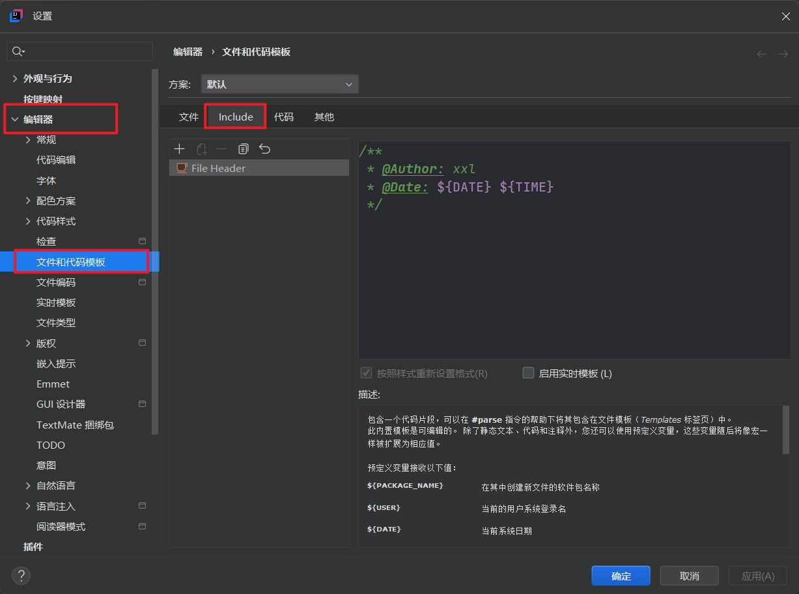

## HTTP请求

使用示例

### GET 请求

~~~http
### GET 请求
GET http://ip:port/api/interface
Connection: Keep-Alive
User-Agent: Apache-HttpClient/4.5.14 (Java/17.0.7)
Accept-Encoding: br,deflate,gzip,x-gzip
token: forever
Content-Length: 26
Cookie: JSESSIONID=34264A80B64B0446FE522B0274F821F8; JSESSIONID=EC1DD4A3DC18777BE64FDC77496E0AD8
~~~

### POST  formdata请求

~~~http
### post json 请求
http://ip:port/api/interface
Connection: Keep-Alive
User-Agent: Apache-HttpClient/4.5.14 (Java/17.0.7)
Accept-Encoding: br,deflate,gzip,x-gzip
Content-Type: application/x-www-form-urlencoded
token: 410c188a281149a0a163cf78a46ae30e
Content-Length: 26
Cookie: JSESSIONID=34264A80B64B0446FE522B0274F821F8; JSESSIONID=EC1DD4A3DC18777BE64FDC77496E0AD8

param=1

~~~

### POST  json请求

~~~http
### post json 请求
POST http://ip:port/api/interface
Connection: Keep-Alive
User-Agent: Apache-HttpClient/4.5.14 (Java/17.0.7)
Accept-Encoding: br,deflate,gzip,x-gzip
Content-Type: application/json
token: forever
Content-Length: 26
Cookie: JSESSIONID=34264A80B64B0446FE522B0274F821F8; JSESSIONID=EC1DD4A3DC18777BE64FDC77496E0AD8

{
  "index": 1,
  "size": 10,
  "id": 1,
  "name": ""
}
~~~

### POST 文件请求

~~~http
### post 文件请求
POST http://ip:port/api/fileUpload
Connection: Keep-Alive
User-Agent: Apache-HttpClient/4.5.14 (Java/17.0.7)
Accept-Encoding: br,deflate,gzip,x-gzip
token: forever
Content-Type: multipart/form-data; boundary=WebAppBoundary
Cookie: JSESSIONID=34264A80B64B0446FE522B0274F821F8; JSESSIONID=EC1DD4A3DC18777BE64FDC77496E0AD8

# name接口定义的参数名，filename 文件名（我们可以自己取名字）
--WebAppBoundary--
Content-Disposition: form-data; name="file"; filename="模板.xlsx"
Content-Type: multipart/form-data

#文件地址 （注意⚠️，这个地方上面一定要空一行，不然文件上传失败，文件大小为0）
< C:\Users\xxl\Downloads\模板.xlsx

--WebAppBoundary--
~~~

HTTP Client请求测试工具的使用 https://blog.csdn.net/huantai3334/article/details/115905570

https://blog.csdn.net/weixin_44000238/article/details/109501241

## 快捷键

- 小写/大写转换Mac：Command + Shift + U
- 小写/大写转换Windows：Ctrl + Shift + U

## javadoc生成

1. Tools >> Generate JavaDoc
2. Generate JavaDoc scope：根据需要选择自己要生成的部分。可以加选几个文件，也可以选择范围。
3. Output directory：输出的位置 。
4. 可见性级别：根据实体中的字段调整到 private。
5. @deprecated 默认就好（按首字母排序or字段顺序与实体类保持一致）。
6. 设置语言Locale：zh_CN。
7. 命令行参数（设置字符集）Other command line arguuments：-encoding UTF-8 -charset UTF-8。

https://blog.csdn.net/jx520/article/details/127058046

## IDEA无法打开Marketplace

[https://blog.csdn.net/weixin_44161378/article/details/110295965](https://blog.csdn.net/weixin_44161378/article/details/110295965)

## 创建模板文件

File --> Settings --> Editor--> File and Code Templates

插入模板信息

~~~java
/**
 * @Classname ${NAME}
 * @Description TODO
 * @Date ${DATE} ${TIME}
 * @Created by ${USER}
 */
 
 /**
 * @author  yd
 * @date  ${DATE} ${TIME}
 * @version 1.0
 */
 
 /**
 * Created by xu_xiaolong on ${DATE}.
 */
~~~

方法设置模板

https://blog.csdn.net/sdut406/article/details/81750858

## 护眼色

~~~
File->Settings->Editor->Color Scheme->General->Text->Default text->background 199 237 204 or C7EDCC
~~~

## 在方法之间加入一条分割线

~~~
File —> Settings...—> Editor —> General —> Appearance —> Show method separators
~~~

分割线的颜色

~~~
edit —> color scheme —> general —> code（右侧面板中的code，点一下）—> method separator color
~~~

## 主题

     主题网址：http://color-themes.com/?view=index
     主题jar包：file –> import setttings –>主题jar文件 –> 确认 –> 重启
     自定义主题导出：file –> Export setttings –> 选中保存路径--> 确认
     更换主题后怎么改字体大小：File—Settings—Editor—Color Scheme----color scheme font